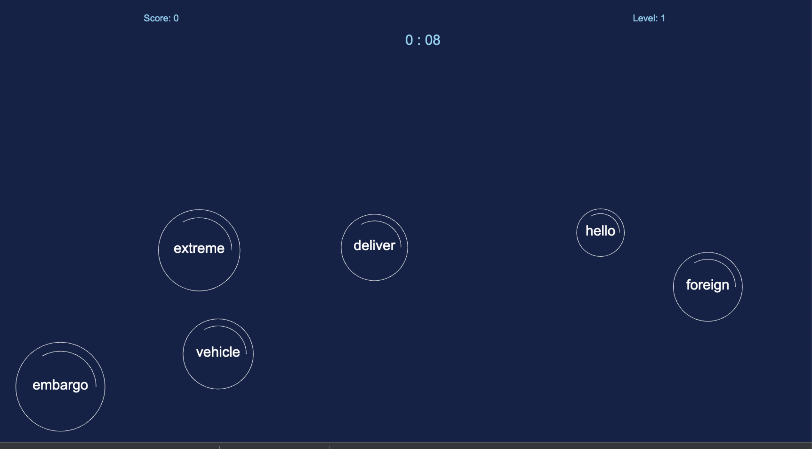
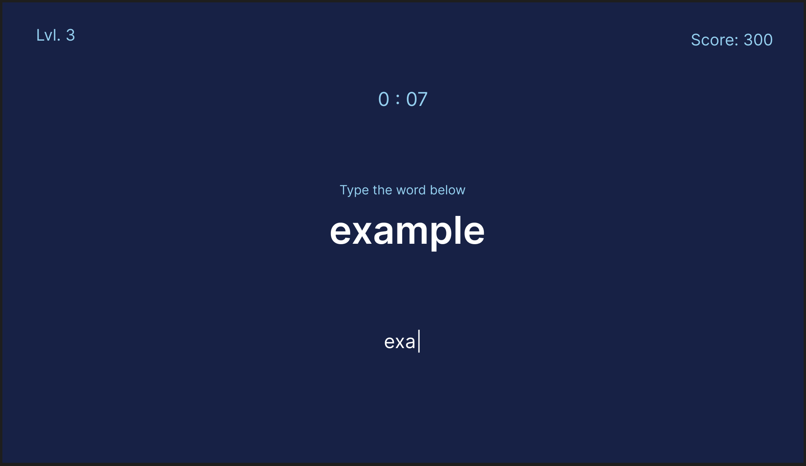
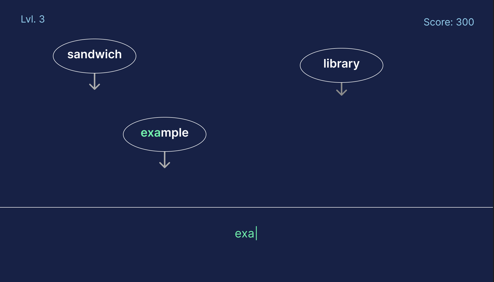

# Bubble Words

[Live demo](https://pkeen.github.io/BubbleWords/)

## Tech Stacks
* Vanilla Javascript
* HTML
* CSS
* Howler.js (for the audio)

## Intro 
BubbleWords is a game for people who want to increase their touch-typing speed and accuracy. 
Words will appear floating on the screen inside of bubbles, when a player types one of those words correctly, and points are scored. 
The game will progress, as longer words are added a larger score is needed per round to advance. 

## Desinging
This project was really fun to design and build, I had to think a lot about the best way to arrange my project.
I ended up using a modular design, with the game object containing data for the game and the display object handling the representation. 
Even despite planning, it was sometimes difficult to maintain a true seperation of concerns. 

## Stretch Goals
* touch typing beginner tutorial rounds
* Animation: Words float upwards and dissapear vertically
* Would it look better if the animation was SVG?

# The Pitch

## Elevator Pitch

## Wireframes
### Basic Game

### Floating Bubbles Variation

## MVP Goals
* A target word is displayed on screen
* User keyboard input is tracked and compared against the target
* An accurate timer counts down
* Player wins round if they can type the target word before timer ends
* If timer ends before game over

## Stretch Goals
* Ticking sound for timer
* Typing sound : positive for correct in sequence negative sound for out of sequence. 
* Some minimal background music
* animation for timer
* touch typing beginner tutorial rounds
* animated Keyboard highlighting where to press
* Tutorial for finger positioning for correct typing technique. 
* Animation: Words float upwards and dissapear vertically
* Would it look better if the animation was SVG?

## Roadblocks
* Finding the best way to structure game logic
* Animation could get confusing
* Setting MVP priority first